# Google Weather Icons
A collection of the official weather icons used by Google.

**Disclaimer**: I do not own these icons. All rights belong to Google.

### Formats
I could only find PNG versions of the v1 and v2 icons. I've used the highest resolution I could obtain from Google.

SVGs are available for v3 and v4 and have been optimised using [SVGOMG](https://svgomg.net/). I have purposefully not minimised the SVGs as I believe it is better to have readable SVGs. However, do as you wish with them.

Fun fact: [Did you know that Google has a typo for one of their icons?](https://twitter.com/MrDarrenGriffin/status/1725896460363788681)

## Support me
If you found my repository useful, feel free to credit me in your project or

# Icons
Below are the icons for each version downscaled to 64px. They have been somewhat grouped by icon type but are not in any particular order.
## v1
In this variant, no night versions exist.
### Day
[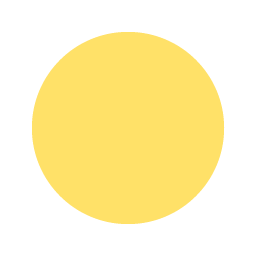](v1/sunny.png)

[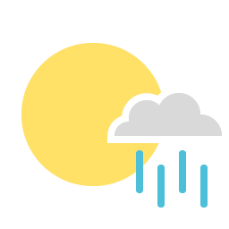](v1/sunny_s_rain.png)
### General

[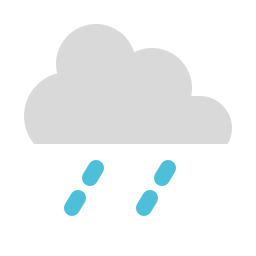](v1/rain_light.png)

[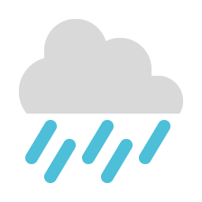](v1/rain_heavy.png)

[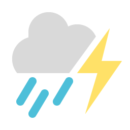](v1/thunderstorms.png)
[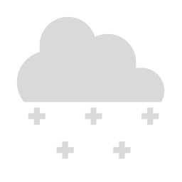](v1/snow_light.png)

[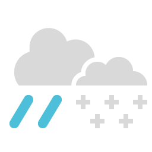](v1/rain_s_snow.png)

[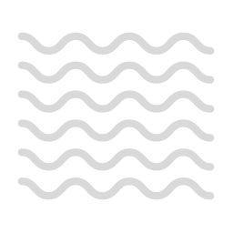](v1/fog.png)

### Misc

## v2
### Day

[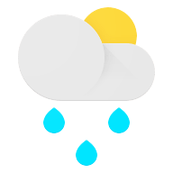](v2/scattered_showers_day.png)
[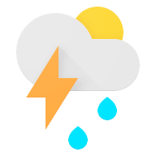](v2/isolated_scattered_tstorms_day.png)
### Night

[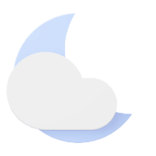](v2/partly_cloudy_night.png)

[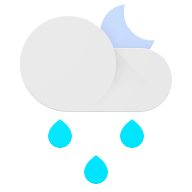](v2/scattered_showers_night.png)
[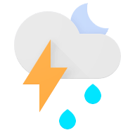](v2/isolated_scattered_tstorms_night.png)
### General

[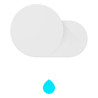](v2/drizzle.png)

[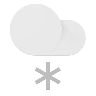](v2/flurries.png)
[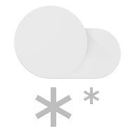](v2/snow_showers_snow.png)
[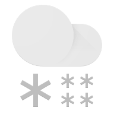](v2/heavy_snow.png)
[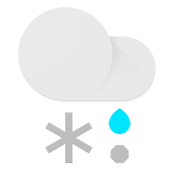](v2/wintry_mix_rain_snow.png)

[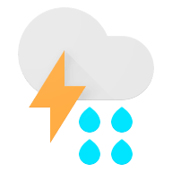](v2/strong_tstorms.png)
[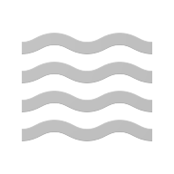](v2/haze_fog_dust_smoke.png)

[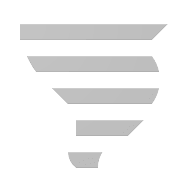](v2/tornado.png)

## v3
For some reason, Google chose to make the moon yellow in this variant. I have made a custom alternative which is more realistic.
### Day

### Night

### MrDarrenGriffin's Night Alternative
I've altered these icons inherit the same moon gradient as v4 which, in my opinion, looks better.

### General

[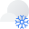](v3/snow_showers.svg)

[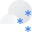](v3/scattered_snow.svg)

[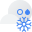](v3/wintry_mix.svg)

### Misc

## v4
### Day

[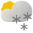](v4/scattered_snow_showers_day.svg)

### Night

[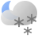](v4/scattered_snow_showers_night.svg)

### General

[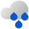](v4/showers_rain.svg)
[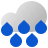](v4/heavy_rain.svg)
[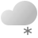](v4/flurries.svg)
[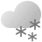](v4/showers_snow.svg)
[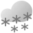](v4/heavy_snow.svg)
[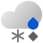](v4/mixed_rain_snow.svg)

[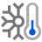](v4/very_cold.svg)

### Japanese Regional (Thanks to [@NikSavchenk0](https://github.com/mrdarrengriffin/google-weather-icons/issues/3))
[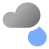](v4/cloudy_with_rain_dark.svg)
[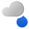](v4/cloudy_with_rain_light.svg)
[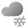](v4/cloudy_with_snow_dark.svg)
[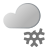](v4/cloudy_with_snow_light.svg)

[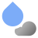](v4/rain_with_cloudy_dark.svg)
[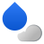](v4/rain_with_cloudy_light.svg)

[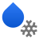](v4/rain_with_snow_light.svg)

[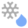](v4/snow_with_rain_dark.svg)
[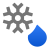](v4/snow_with_rain_light.svg)
[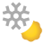](v4/snow_with_sunny_dark.svg)
[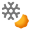](v4/snow_with_sunny_light.svg)

[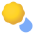](v4/sunny_with_rain_dark.svg)

[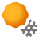](v4/sunny_with_snow_light.svg)

# TODO
- [x] Add custom night icons for v3
- [ ] Add JSON file to map icon names to icon files and to easily switch variants

<picture>
  <source media="(prefers-color-scheme: dark)" srcset="https://api.star-history.com/svg?repos=mrdarrengriffin/google-weather-icons&type=Date&theme=dark" />
  <source media="(prefers-color-scheme: light)" srcset="https://api.star-history.com/svg?repos=mrdarrengriffin/google-weather-icons&type=Date" />
  
</picture>

