# Google Weather Icons
A collection of the official weather icons used by Google.

## v1
### Day

[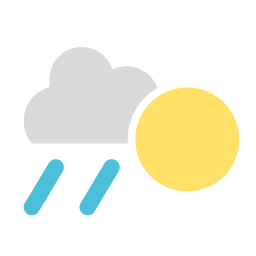](v1/rain_s_sunny.png)

### General

[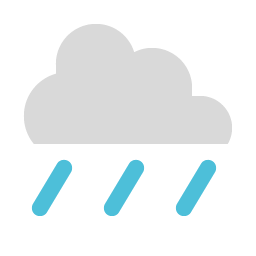](v1/rain.png)

[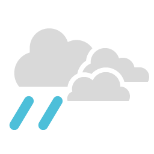](v1/rain_s_cloudy.png)

[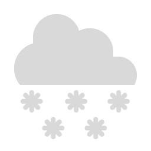](v1/snow.png)
[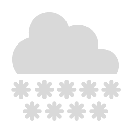](v1/snow_heavy.png)

## v2

## v3
### Day

[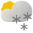](v3/scattered_snow_showers_day.svg)
[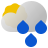](v3/scattered_showers_day.svg)

### Night

### General

[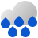](v3/heavy_rain.svg)

[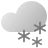](v3/showers_snow.svg)
[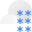](v3/heavy_snow.svg)
[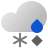](v3/mixed_rain_snow.svg)

[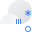](v3/sleet_hail.svg)

[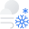](v3/blizzard.svg)

[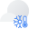](v3/very_cold.svg)
