# Google Weather Icons

> **March 13, 2026**: The repo has been refactored with a new structure. The old `v1`–`v4` folders have been replaced with `sets/set-1` through `sets/set-6`, organized by visual style rather than arbitrary version numbers. We've also added the new accessibility icon sets (outlined and outlined+gradient styles), dark theme variants, Lottie background animations from the Pixel Weather app, and a comprehensive `icons.json` mapping file. See the [Structure](#structure) section below for details.

A comprehensive collection of official weather icons used by Google across their products.

**Disclaimer**: I do not own these icons. All rights belong to Google.

## Structure

Icons are organized into **sets** — each representing a distinct visual style. Sets with theme support have `light/` and `dark/` subdirectories. An `icons.json` file at the root maps every weather condition to its icon files across all sets.

```
sets/
├── set-1/              # Google Search (Original) — PNGs
├── set-2/              # Google Search (Updated) — PNGs
├── set-3/              # Google Maps Weather — 32x32 SVGs
│   ├── light/
│   └── dark/
├── set-4/              # Google Weather (Filled) — 48x48 SVGs
│   ├── light/
│   └── dark/
├── set-5/              # Google Weather (Outlined) — 48x48 SVGs
│   ├── light/
│   └── dark/
├── set-6/              # Google Weather (Outlined + Gradient) — 48x48 SVGs
│   ├── light/
│   └── dark/
└── lottie/             # Animated weather backgrounds — Lottie JSON
    ├── phone_portrait/
    ├── phone_portrait_night/
    ├── phone_landscape/
    ├── phone_landscape_night/
    ├── tablet_portrait/
    ├── tablet_portrait_night/
    ├── tablet_landscape/
    └── tablet_landscape_night/
```

## Sets

### set-1 — Google Search (Original)
The original weather icons from Google Search. PNG format, day variants only.

#### Misc
[](sets/set-1/arrow_selected.svg)
[](sets/set-1/arrow_unselected.svg)

#### Weather
[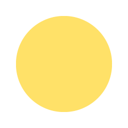](sets/set-1/sunny.png)
[](sets/set-1/sunny_s_cloudy.png)
[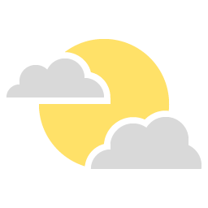](sets/set-1/partly_cloudy.png)
[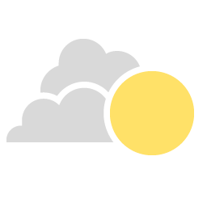](sets/set-1/cloudy_s_sunny.png)
[](sets/set-1/cloudy.png)
[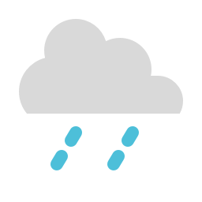](sets/set-1/rain_light.png)
[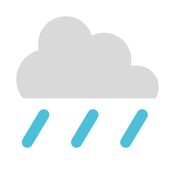](sets/set-1/rain.png)
[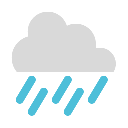](sets/set-1/rain_heavy.png)
[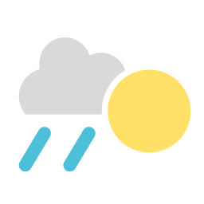](sets/set-1/rain_s_sunny.png)
[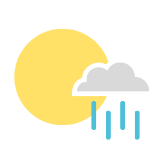](sets/set-1/sunny_s_rain.png)
[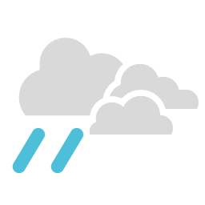](sets/set-1/rain_s_cloudy.png)
[](sets/set-1/cloudy_s_rain.png)
[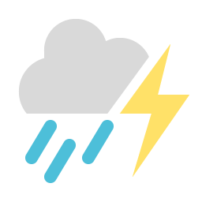](sets/set-1/thunderstorms.png)
[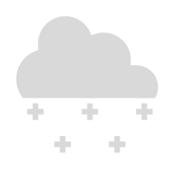](sets/set-1/snow_light.png)
[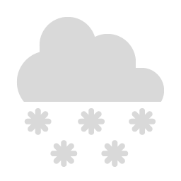](sets/set-1/snow.png)
[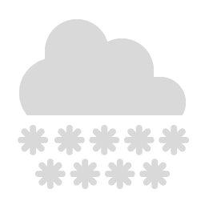](sets/set-1/snow_heavy.png)
[](sets/set-1/snow_s_cloudy.png)
[](sets/set-1/cloudy_s_snow.png)
[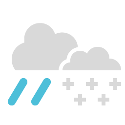](sets/set-1/rain_s_snow.png)
[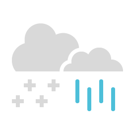](sets/set-1/snow_s_rain.png)
[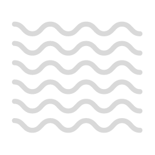](sets/set-1/fog.png)

### set-2 — Google Search (Updated)
Updated icons from Google Search with more weather conditions and day/night variants. PNG format.

#### Day
[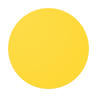](sets/set-2/sunny.png)
[](sets/set-2/mostly_sunny.png)
[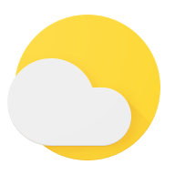](sets/set-2/partly_cloudy.png)
[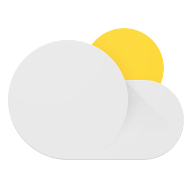](sets/set-2/mostly_cloudy_day.png)
[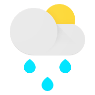](sets/set-2/scattered_showers_day.png)
[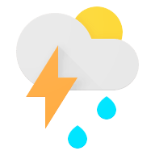](sets/set-2/isolated_scattered_tstorms_day.png)

#### Night
[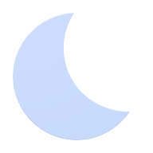](sets/set-2/clear_night.png)
[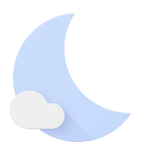](sets/set-2/mostly_clear_night.png)
[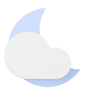](sets/set-2/partly_cloudy_night.png)
[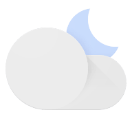](sets/set-2/mostly_cloudy_night.png)
[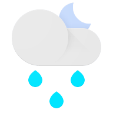](sets/set-2/scattered_showers_night.png)
[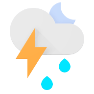](sets/set-2/isolated_scattered_tstorms_night.png)

#### General
[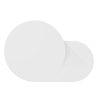](sets/set-2/cloudy.png)
[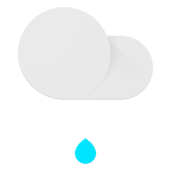](sets/set-2/drizzle.png)
[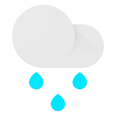](sets/set-2/showers_rain.png)
[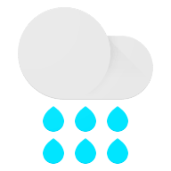](sets/set-2/heavy_rain.png)
[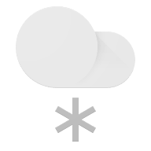](sets/set-2/flurries.png)
[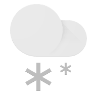](sets/set-2/snow_showers_snow.png)
[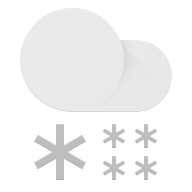](sets/set-2/heavy_snow.png)
[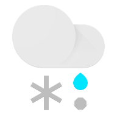](sets/set-2/wintry_mix_rain_snow.png)
[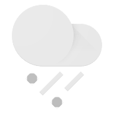](sets/set-2/sleet_hail.png)
[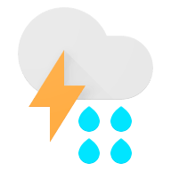](sets/set-2/strong_tstorms.png)
[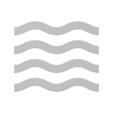](sets/set-2/haze_fog_dust_smoke.png)
[](sets/set-2/blowing_snow.png)
[](sets/set-2/blizzard.png)
[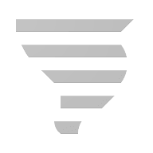](sets/set-2/tornado.png)

### set-3 — Google Maps Weather
32x32 flat colored SVGs from the [Google Maps Weather API](https://developers.google.com/maps/documentation/weather/weather-condition-icons). Light and dark theme variants.

#### Light
[](sets/set-3/light/sunny.svg)
[](sets/set-3/light/mostly_sunny.svg)
[](sets/set-3/light/partly_cloudy.svg)
[](sets/set-3/light/mostly_cloudy.svg)
[](sets/set-3/light/cloudy.svg)
[](sets/set-3/light/clear.svg)
[](sets/set-3/light/partly_clear.svg)
[](sets/set-3/light/mostly_clear.svg)
[](sets/set-3/light/mostly_cloudy_night.svg)
[](sets/set-3/light/drizzle.svg)
[](sets/set-3/light/showers.svg)
[](sets/set-3/light/scattered_showers.svg)
[](sets/set-3/light/heavy.svg)
[](sets/set-3/light/flurries.svg)
[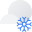](sets/set-3/light/snow_showers.svg)
[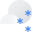](sets/set-3/light/scattered_snow.svg)
[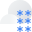](sets/set-3/light/heavy_snow.svg)
[](sets/set-3/light/blowing_snow.svg)
[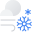](sets/set-3/light/blizzard.svg)
[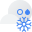](sets/set-3/light/wintry_mix.svg)
[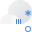](sets/set-3/light/sleet_hail.svg)
[](sets/set-3/light/icy.svg)
[](sets/set-3/light/isolated_tstorms.svg)
[](sets/set-3/light/strong_tstorms.svg)
[](sets/set-3/light/tornado.svg)
[](sets/set-3/light/windy_breezy.svg)
[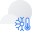](sets/set-3/light/very_cold.svg)
[](sets/set-3/light/fog.svg)
[](sets/set-3/light/mist.svg)
[](sets/set-3/light/dust.svg)
[](sets/set-3/light/smoke.svg)

#### Night Alternatives
Custom moon variants with a more realistic gradient (replaces Google's yellow moon).

[](sets/set-3/light/clear_alt.svg)
[](sets/set-3/light/partly_clear_alt.svg)
[](sets/set-3/light/mostly_clear_alt.svg)
[](sets/set-3/light/mostly_cloudy_night_alt.svg)

#### Misc
[](sets/set-3/light/arrow.svg)
[](sets/set-3/light/arrow_2.svg)
[](sets/set-3/light/arrow_3.svg)
[](sets/set-3/light/arrow_4.svg)
[](sets/set-3/light/arrow_5.svg)

[](sets/set-3/light/droplet_clear.svg)
[](sets/set-3/light/droplet_drizzle.svg)
[](sets/set-3/light/droplet_light.svg)
[](sets/set-3/light/droplet_moderate.svg)
[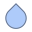](sets/set-3/light/droplet_heavy.svg)

#### Dark
[](sets/set-3/dark/sunny.svg)
[](sets/set-3/dark/mostly_sunny.svg)
[](sets/set-3/dark/partly_cloudy.svg)
[](sets/set-3/dark/mostly_cloudy.svg)
[](sets/set-3/dark/cloudy.svg)
[](sets/set-3/dark/clear.svg)
[](sets/set-3/dark/partly_clear.svg)
[](sets/set-3/dark/mostly_clear.svg)
[](sets/set-3/dark/mostly_cloudy_night.svg)
[](sets/set-3/dark/drizzle.svg)
[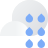](sets/set-3/dark/showers.svg)
[](sets/set-3/dark/scattered_showers.svg)
[](sets/set-3/dark/heavy.svg)
[](sets/set-3/dark/flurries.svg)
[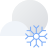](sets/set-3/dark/snow_showers.svg)
[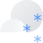](sets/set-3/dark/scattered_snow.svg)
[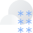](sets/set-3/dark/heavy_snow.svg)
[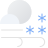](sets/set-3/dark/blowing_snow.svg)
[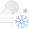](sets/set-3/dark/blizzard.svg)
[](sets/set-3/dark/wintry_mix.svg)
[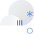](sets/set-3/dark/sleet_hail.svg)
[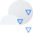](sets/set-3/dark/icy.svg)
[](sets/set-3/dark/isolated_tstorms.svg)
[](sets/set-3/dark/strong_tstorms.svg)
[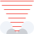](sets/set-3/dark/tornado.svg)
[](sets/set-3/dark/windy_breezy.svg)
[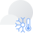](sets/set-3/dark/very_cold.svg)
[](sets/set-3/dark/mist.svg)
[](sets/set-3/dark/dust.svg)
[](sets/set-3/dark/smoke.svg)

### set-4 — Google Weather (Filled)
48x48 gradient-filled SVGs with rich colors. Includes Japanese regional weather icons contributed by [@NikSavchenk0](https://github.com/mrdarrengriffin/google-weather-icons/issues/3).

#### Day
[](sets/set-4/light/clear_day.svg)
[](sets/set-4/light/mostly_clear_day.svg)
[](sets/set-4/light/partly_cloudy_day.svg)
[](sets/set-4/light/mostly_cloudy_day.svg)
[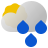](sets/set-4/light/scattered_showers_day.svg)
[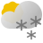](sets/set-4/light/scattered_snow_showers_day.svg)
[](sets/set-4/light/isolated_scattered_thunderstorms_day.svg)
[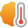](sets/set-4/light/very_hot.svg)

#### Night
[](sets/set-4/light/clear_night.svg)
[](sets/set-4/light/mostly_clear_night.svg)
[](sets/set-4/light/partly_cloudy_night.svg)
[](sets/set-4/light/mostly_cloudy_night.svg)
[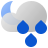](sets/set-4/light/scattered_showers_night.svg)
[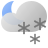](sets/set-4/light/scattered_snow_showers_night.svg)
[](sets/set-4/light/isolated_scattered_thunderstorms_night.svg)

#### General
[](sets/set-4/light/cloudy.svg)
[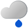](sets/set-4/light/drizzle.svg)
[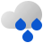](sets/set-4/light/showers_rain.svg)
[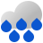](sets/set-4/light/heavy_rain.svg)
[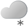](sets/set-4/light/flurries.svg)
[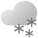](sets/set-4/light/showers_snow.svg)
[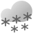](sets/set-4/light/heavy_snow.svg)
[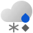](sets/set-4/light/mixed_rain_snow.svg)
[](sets/set-4/light/mixed_rain_hail_sleet.svg)
[](sets/set-4/light/sleet_hail.svg)
[](sets/set-4/light/strong_thunderstorms.svg)
[](sets/set-4/light/isolated_thunderstorms.svg)
[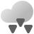](sets/set-4/light/icy.svg)
[](sets/set-4/light/tropical_storm_hurricane.svg)
[](sets/set-4/light/haze_fog_dust_smoke.svg)
[](sets/set-4/light/windy.svg)
[](sets/set-4/light/blowing_snow.svg)
[](sets/set-4/light/blizzard.svg)
[](sets/set-4/light/tornado.svg)
[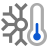](sets/set-4/light/very_cold.svg)
[](sets/set-4/light/umbrella.svg)

#### Japanese Regional
Thanks to [@NikSavchenk0](https://github.com/mrdarrengriffin/google-weather-icons/issues/3).

[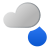](sets/set-4/light/cloudy_with_rain.svg)
[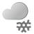](sets/set-4/light/cloudy_with_snow.svg)
[](sets/set-4/light/cloudy_with_sunny.svg)
[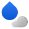](sets/set-4/light/rain_with_cloudy.svg)
[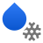](sets/set-4/light/rain_with_snow.svg)
[](sets/set-4/light/rain_with_sunny.svg)
[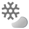](sets/set-4/light/snow_with_cloudy.svg)
[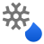](sets/set-4/light/snow_with_rain.svg)
[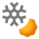](sets/set-4/light/snow_with_sunny.svg)
[](sets/set-4/light/sunny_with_cloudy.svg)
[](sets/set-4/light/sunny_with_rain.svg)
[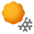](sets/set-4/light/sunny_with_snow.svg)

### set-5 — Google Weather (Outlined)
48x48 outlined/stroked SVGs with minimal fills. A cleaner, more modern style.

[](sets/set-5/light/sunny.svg)
[](sets/set-5/light/mostly_sunny.svg)
[](sets/set-5/light/partly_cloudy.svg)
[](sets/set-5/light/cloudy.svg)
[](sets/set-5/light/clear_night.svg)
[](sets/set-5/light/mostly_clear_night.svg)
[](sets/set-5/light/partly_cloudy_night.svg)
[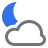](sets/set-5/light/mostly_cloudy_night.svg)
[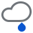](sets/set-5/light/drizzle.svg)
[](sets/set-5/light/heavy_rain.svg)
[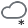](sets/set-5/light/flurries.svg)
[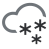](sets/set-5/light/snow_showers.svg)
[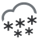](sets/set-5/light/heavy_snow.svg)
[](sets/set-5/light/blowing_snow.svg)
[](sets/set-5/light/blizzard.svg)
[](sets/set-5/light/wintry_mix.svg)
[](sets/set-5/light/sleet_hail.svg)
[](sets/set-5/light/icy.svg)
[](sets/set-5/light/thunderstorms.svg)
[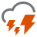](sets/set-5/light/strong_thunderstorms.svg)
[](sets/set-5/light/hurricane.svg)
[](sets/set-5/light/tornado.svg)
[](sets/set-5/light/windy.svg)

### set-6 — Google Weather (Outlined + Gradient)
48x48 outlined SVGs with gradient fills. The newest icon style.

[](sets/set-6/light/sunny.svg)
[](sets/set-6/light/mostly_sunny.svg)
[](sets/set-6/light/partly_cloudy.svg)
[](sets/set-6/light/cloudy.svg)
[](sets/set-6/light/clear_night.svg)
[](sets/set-6/light/mostly_clear_night.svg)
[](sets/set-6/light/partly_cloudy_night.svg)
[](sets/set-6/light/mostly_cloudy_night.svg)
[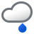](sets/set-6/light/drizzle.svg)
[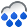](sets/set-6/light/heavy_rain.svg)
[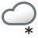](sets/set-6/light/flurries.svg)
[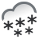](sets/set-6/light/heavy_snow.svg)
[](sets/set-6/light/blowing_snow.svg)
[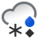](sets/set-6/light/wintry_mix.svg)
[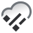](sets/set-6/light/sleet_hail.svg)
[](sets/set-6/light/icy.svg)
[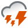](sets/set-6/light/strong_thunderstorms.svg)
[](sets/set-6/light/hurricane.svg)
[](sets/set-6/light/tornado.svg)
[](sets/set-6/light/windy.svg)
[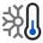](sets/set-6/light/very_cold.svg)
[](sets/set-6/light/very_hot.svg)

### Lottie — Weather Background Animations
Lottie JSON animations extracted from the Pixel Weather app (`com.google.android.apps.weather`). These are the animated backgrounds shown behind weather conditions.

Available in 8 variants: phone/tablet, portrait/landscape, day/night.

## Recommended Set

**set-4** has the best coverage (72% of all conditions) and is the only set with Japanese regional icons. If you need a single set to cover most use cases, start there.

## icons.json

The `icons.json` file maps weather conditions to their corresponding icon files across all sets. Each condition includes:

- **`label`** — Human-readable name
- **`aliases`** — Alternative condition names used across different Google products (useful for mapping API responses)
- **`has_day_night`** — Whether the condition has separate day and night icons
- **`region`** — If the icon is region-specific (e.g. `"japan"`)
- **`sets`** — Which sets contain this icon, with filenames for each variant (`day`, `night`, or `default`)

Each set definition includes a **`path_template`** so you can construct full file paths:

```js
const icons = require('./icons.json');

// Get the clear/sunny icon from set-4
const condition = icons.conditions.clear;
const set = icons.sets['set-4'];
const file = condition.sets['set-4'].day; // 'clear_day.svg'
const path = set.path_template
  .replace('{theme}', 'light')
  .replace('{filename}', file);
// 'sets/set-4/light/clear_day.svg'

// Find all sets that have a tornado icon
const tornado = icons.conditions.tornado;
Object.keys(tornado.sets); // ['set-2', 'set-3', 'set-4', 'set-5', 'set-6']

// Look up a condition by alias
const byAlias = Object.entries(icons.conditions)
  .find(([_, c]) => c.aliases?.includes('sunny'));
// ['clear', { label: 'Clear Sky', ... }]
```

> **Note:** Because different Google products use different naming conventions (e.g. `sunny` vs `clear_day`, `strong_tstorms` vs `strong_thunderstorms`), filenames vary between sets. Always use `icons.json` rather than assuming filenames.

## Sources

| Set | Source | Format |
|-----|--------|--------|
| set-1 | Google Search | PNG |
| set-2 | Google Search | PNG |
| set-3 | [Google Maps Weather API](https://developers.google.com/maps/documentation/weather/weather-condition-icons) (`maps.gstatic.com/weather/v1/`) | SVG 32x32 |
| set-4 | Google Weather (`www.gstatic.com/weather/conditions/v1/svg/`) | SVG 48x48 |
| set-5 | Google Weather (`www.gstatic.com/weather/conditions/v2/svg/`) | SVG 48x48 |
| set-6 | Google Weather (`www.gstatic.com/weather/conditions/v3/svg/`) | SVG 48x48 |
| lottie | Google Weather APK | Lottie JSON |

## License

All icons are the property of Google. This repository is for reference and educational purposes.

<picture>
  <source media="(prefers-color-scheme: dark)" srcset="https://api.star-history.com/svg?repos=mrdarrengriffin/google-weather-icons&type=Date&theme=dark" />
  <source media="(prefers-color-scheme: light)" srcset="https://api.star-history.com/svg?repos=mrdarrengriffin/google-weather-icons&type=Date" />
  
</picture>
