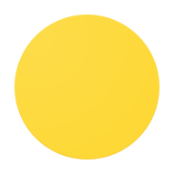
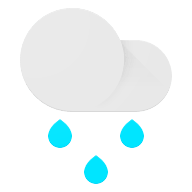

# Google Weather Icons
A collection of the official weather icons used by Google.

**Disclaimer**: I do not own these icons. All rights belong to Google.

### Formats
I could only find PNG versions of the v1 and v2 icons. I've used the highest resolution I could obtain from Google.

SVGs are available for v3 and v4 and have been optimised using [SVGOMG](https://svgomg.net/). I have purposefully not minimised the SVGs as I believe it is better to have readable SVGs. However, do as you wish with them.

Fun fact: [Did you know that Google has a typo for one of their icons?](https://twitter.com/MrDarrenGriffin/status/1725896460363788681)

## Support me
If you found my repository useful, feel free to credit me in your project or

# Icons
Below are the icons for each version downscaled to 64px. They have been somewhat grouped by icon type but are not in any particular order.
## v1
In this variant, no night versions exist.
### Day

### General

### Misc

## v2
### Day

### Night

### General

## v3
For some reason, Google chose to make the moon yellow in this variant. I have made a custom alternative which is more realistic.
### Day

### Night

### MrDarrenGriffin's Night Alternative
I've altered these icons inherit the same moon gradient as v4 which, in my opinion, looks better.

### General

### Misc

## v4
### Day

### Night

### General

### Japanese Regional (Thanks to [@NikSavchenk0](https://github.com/mrdarrengriffin/google-weather-icons/issues/3))

# TODO
- [x] Add custom night icons for v3
- [ ] Add JSON file to map icon names to icon files and to easily switch variants

<picture>
  <source media="(prefers-color-scheme: dark)" srcset="https://api.star-history.com/svg?repos=mrdarrengriffin/google-weather-icons&type=Date&theme=dark" />
  <source media="(prefers-color-scheme: light)" srcset="https://api.star-history.com/svg?repos=mrdarrengriffin/google-weather-icons&type=Date" />
  
</picture>

